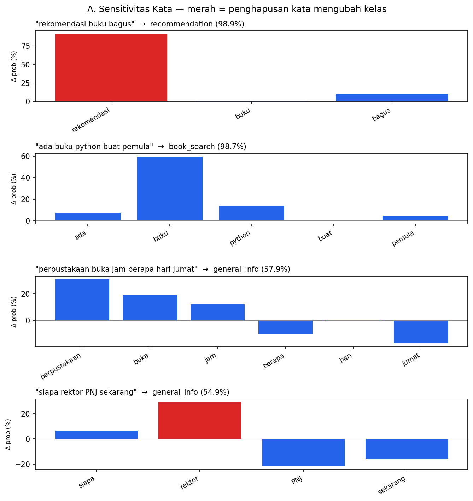
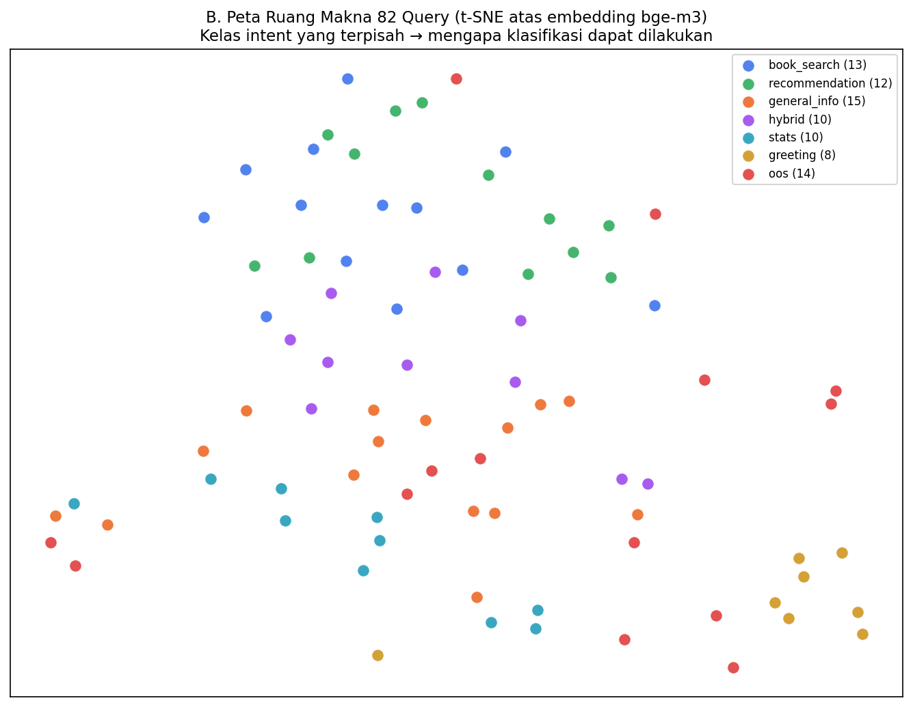
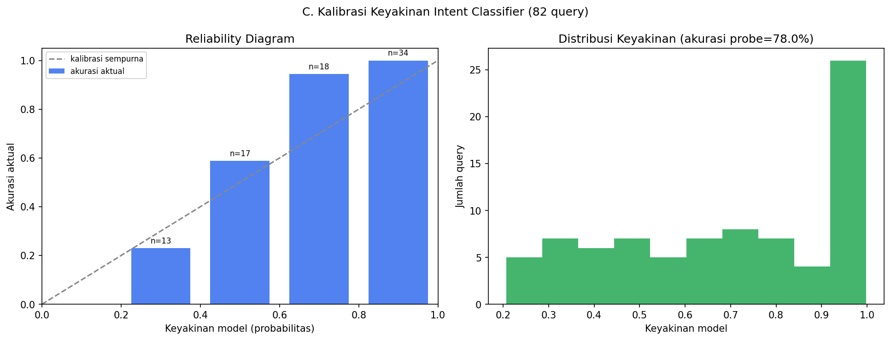

# Explainability Mendalam — Intent Classifier (Qwen)

Tiga sudut pandang yang melengkapi logprob/softmax & confusion matrix.

> ⚠️ A & C: probe klasifikasi sederhana (label→angka) untuk logprob bersih; router produksi (`router.py`) lebih kaya. B: embedding bge-m3 (struktur query). Semua untuk MENJELASKAN mekanisme, konsisten dengan produksi.

## A. Sensitivitas Kata (Occlusion) — kata mana yang menyetir keputusan?

Tiap kata dihapus satu per satu, lalu query diklasifikasi ulang. Penurunan probabilitas kelas asli = seberapa penting kata itu (semakin turun, semakin penting). Jika kelas **berubah**, kata itu menentukan keputusan.

### "rekomendasi buku bagus" → **recommendation** (98.9%)

| Kata dihapus | Prob kelas asli turun jadi | Penting? | Kelas berubah? |
|---|---|---|---|
| rekomendasi | −91.1% | ⬛ besar | 🔴 YA → book_search |
| buku | −0.4% | kecil | tidak |
| bagus | −10.0% | kecil | tidak |

### "ada buku python buat pemula" → **book_search** (98.7%)

| Kata dihapus | Prob kelas asli turun jadi | Penting? | Kelas berubah? |
|---|---|---|---|
| ada | −7.2% | kecil | tidak |
| buku | −59.6% | ⬛ besar | tidak |
| python | −13.9% | kecil | tidak |
| buat | −-0.2% | kecil | tidak |
| pemula | −4.6% | kecil | tidak |

### "perpustakaan buka jam berapa hari jumat" → **general_info** (57.9%)

| Kata dihapus | Prob kelas asli turun jadi | Penting? | Kelas berubah? |
|---|---|---|---|
| perpustakaan | −30.8% | ⬛ besar | tidak |
| buka | −19.1% | kecil | tidak |
| jam | −12.1% | kecil | tidak |
| berapa | −-9.9% | kecil | tidak |
| hari | −0.3% | kecil | tidak |
| jumat | −-17.4% | kecil | tidak |

### "siapa rektor PNJ sekarang" → **general_info** (54.9%)

| Kata dihapus | Prob kelas asli turun jadi | Penting? | Kelas berubah? |
|---|---|---|---|
| siapa | −6.5% | kecil | tidak |
| rektor | −29.3% | ⬛ besar | 🔴 YA → book_search |
| PNJ | −-21.7% | kecil | tidak |
| sekarang | −-15.6% | kecil | tidak |

## B. Peta Ruang Makna (t-SNE)

Ke-82 query di-embed dengan bge-m3 lalu diproyeksikan ke 2D. Tiap titik = satu query, warna = kelas intent sebenarnya. Kelompok yang terpisah menunjukkan intent **dapat dibedakan secara semantik** — landasan mengapa klasifikasi berhasil.

## C. Kalibrasi Keyakinan

Untuk tiap dari 82 query, diukur keyakinan model (probabilitas kelas terpilih) dan apakah prediksinya benar.

- Akurasi probe sederhana ini: **78.0%**
- Query dengan keyakinan ≥80%: **34/82**, akurasinya **100.0%**

Reliability diagram: jika batang mendekati garis diagonal, keyakinan model **terkalibrasi** (yakin tinggi ⇒ benar tinggi).

